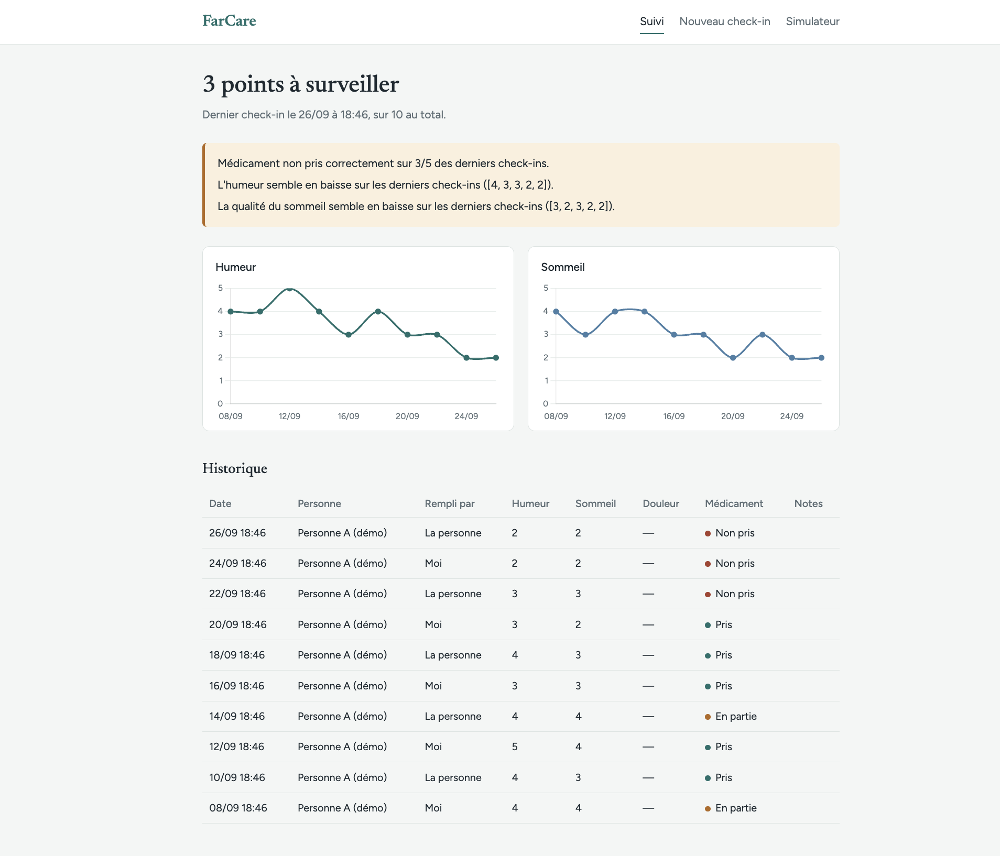
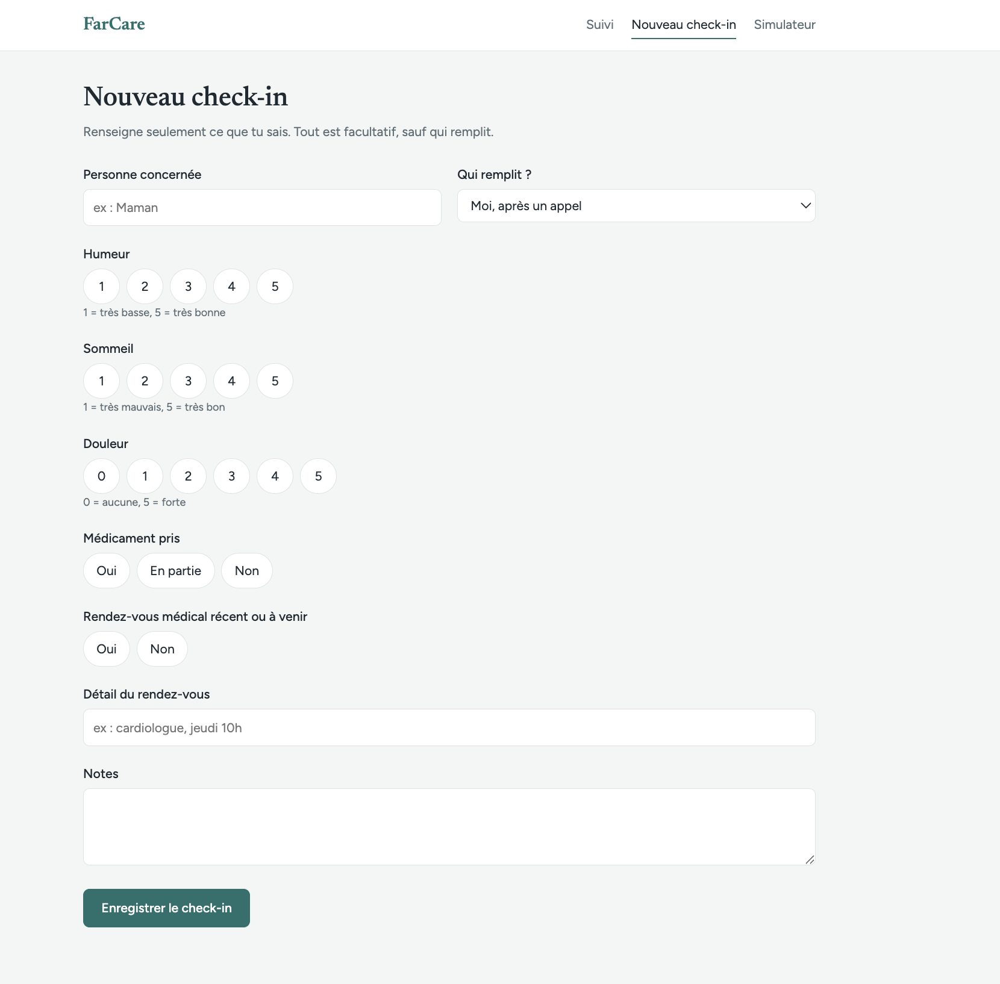
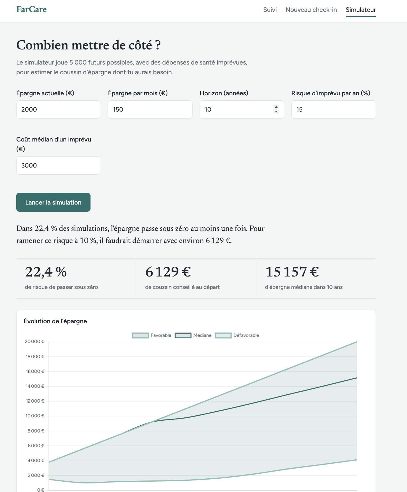

# FarCare

Outil de suivi et de préparation pour les proches aidants à distance : garder un œil sur le bien-être d'un parent qui vit loin, et anticiper l'impact financier d'un imprévu de santé.



*Toutes les captures de ce dépôt utilisent des données fictives.*

## Le problème

Quand on vit loin de parents qui vieillissent, deux questions reviennent : « est-ce que tout va bien en ce moment ? » et « serai-je en mesure de faire face si ça ne va pas ? ». Les outils existants sont soit des applications médicales pensées pour les professionnels, soit des simulateurs financiers génériques. Rien ne relie les deux pour un aidant à distance qui n'est pas un spécialiste.

## Ce que fait l'outil

**Suivi.** Un check-in prend une minute, souvent après un appel : humeur, sommeil, douleur, médicament, rendez-vous, notes. Tous les champs sont facultatifs, pour que le suivi reste léger. Le dashboard affiche l'historique, les courbes d'évolution et les points à surveiller.

**Alertes.** Trois règles interprétables : médicament non pris de façon répétée, humeur en baisse, sommeil en baisse. Choix assumé : avec peu de données, des règles claires sont plus honnêtes qu'un modèle de machine learning entraîné dans le vide. L'étape suivante serait un modèle de détection d'anomalies, une fois qu'il y a assez d'historique pour l'entraîner.

**Simulateur.** Une simulation Monte Carlo (5 000 scénarios) estime le risque de passer sous zéro face à une dépense de santé imprévue, et le coussin d'épargne à prévoir pour ramener ce risque à 10 %. Le résultat s'affiche sous forme de bande de trajectoires (favorable, médiane, défavorable).

<p>
  
  
</p>

## Stack technique

- **Backend** : FastAPI, SQLAlchemy, Pydantic
- **Base de données** : SQLite
- **Calcul** : NumPy (simulation Monte Carlo)
- **Interface** : templates Jinja2, Chart.js, CSS sans framework

## Installation

```bash
python -m venv venv
source venv/bin/activate
pip install -r requirements.txt
cp .env.example .env
uvicorn app.main:app --reload
```

L'application est disponible sur `http://localhost:8000`. La documentation de l'API est sur `/docs`.

### Lancer avec des données de démonstration

```bash
python -m data.seed_demo
DATABASE_URL=sqlite:///./demo.db uvicorn app.main:app --reload
```

La base de démo (`demo.db`) est séparée de la base d'usage réel (`farcare.db`). Les deux sont exclues du versionnement.

## Limites et hypothèses

- Les paramètres par défaut du simulateur (risque annuel de 15 %, coût médian de 3 000 €, volatilité du change de 10 %) sont **illustratifs**, pas des statistiques réelles. La valeur de l'outil est de rendre ces hypothèses explicites et modifiables, pas de prédire l'avenir.
- L'outil ne pose aucun diagnostic et ne remplace pas un avis médical.
- Il s'agit d'un prototype mono-utilisateur, sans authentification. Il manipule des données de santé : ne pas le déployer en ligne sans avoir ajouté comptes, droits d'accès et chiffrement.

## Pistes d'évolution

- **Coordination entre plusieurs aidants** : comptes et rôles (aidant, lecteur), agenda partagé des rendez-vous médicaux, vue « qui accompagne qui ».
- Modèle de rendez-vous dédié, à la place des champs actuels du check-in.
- Calibration des paramètres du simulateur sur des sources réelles, et prise en compte d'un risque de change.
- Détection d'anomalies par apprentissage une fois l'historique suffisant.